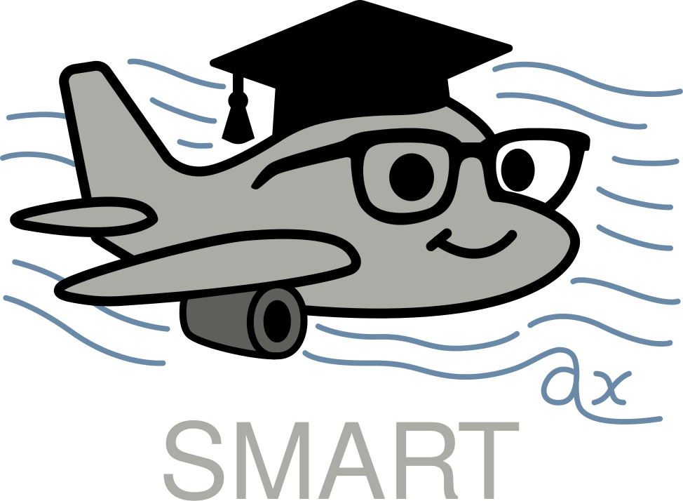

<p align="center"></p>

<h1 align="center">SMART: Scalable Mesh-free Aerodynamic Simulations from Raw Geometries using a Transformer-based Surrogate Model</h1> 
<p align="center" style="font-size:16px">
  <a target="_blank" href="https://jhagnberger.github.io"><strong>Jan Hagnberger</strong></a> and
  <a target="_blank" href="https://matlog.net"><strong>Mathias Niepert</strong></a>
</p>


This repository contains the official PyTorch implementation of the SMART model from the paper, "[**SMART: Scalable Mesh-free Aerodynamic Simulations from Raw Geometries using a Transformer-based Surrogate Model**](https://arxiv.org/abs/2601.18707)".


## 🛠️ Requirements
To use the SMART model, ensure the following packages are installed:
- [PyTorch](https://pytorch.org) in version 2.6.0
- [NumPy](https://numpy.org) in version 2.1.2
- [Einops](https://einops.rocks) in version 0.8.1

To use the datasets and training scripts, the following additional packages are required:
- [VTK](https://vtk.org) in version 9.4.2
- [lion-pytorch](https://github.com/lucidrains/lion-pytorch) in version 0.2.3

Please also see the [``environment.yml``](./environment.yml) file, which contains all packages to run the provided examples.


## 🤖 Using the SMART Model
The SMART model is implemented in [``smart/models/smart/smart.py``](./smart/models/smart/smart.py). Below are examples of how to use the model for different scenarios.

### 1. No Additional Simulation Parameters
```python
import torch
from models.smart.smart import SMART

device = torch.device('cuda' if torch.cuda.is_available() else 'cpu')

# Initialize the model with 1 surface channel, 3 volume channels, and no parameter channels
model = SMART(surface_channels=1, volume_channels=3, parameter_channels=0).to(device)

# Generate random 3D data
geometry_point_cloud = torch.rand(1, 65536, 3, device=device)  # (batch size, number geometry points, spatial_dim)
surface_query_coordinates = torch.rand(1, 16384, 3, device=device)  # (batch size, number surface points, spatial_dim)
volume_query_coordinates = torch.rand(1, 32768, 3, device=device)  # (batch size, number volume points, spatial_dim)

# Forward pass
surface_predictions, volume_predictions = model.forward(geometry_point_cloud, surface_query_coordinates, volume_query_coordinates, None) # (batch size, number surface points, surface_channels), (batch size, number volume points, volume_channels)
```

### 2. With Additional Simulation Parameters
```python
import torch
from models.smart.smart import SMART

device = torch.device('cuda' if torch.cuda.is_available() else 'cpu')

# Initialize the model with 1 surface channel, 3 volume channels, and 2 parameter channels
model = SMART(surface_channels=1, volume_channels=3, parameter_channels=2).to(device)

# Generate random 3D data
geometry_point_cloud = torch.rand(1, 65536, 3, device=device)  # (batch size, number geometry points, spatial_dim)
surface_query_coordinates = torch.rand(1, 16384, 3, device=device)  # (batch size, number surface points, spatial_dim)
volume_query_coordinates = torch.rand(1, 32768, 3, device=device)  # (batch size, number volume points, spatial_dim)
simulation_parameters = torch.rand(1, 2, device=device)  # (batch size, parameter_channels)

# Forward pass
surface_predictions, volume_predictions = model.forward(geometry_point_cloud, surface_query_coordinates, volume_query_coordinates, simulation_parameters) # (batch size, number surface points, surface_channels), (batch size, number volume points, volume_channels)
```

### 3. Inference with a Large Number of Query Points (e.g., 33M Volume Points and 8M Surface Points)
To handle large-scale inference, use the ``inference`` method of the model to process query points sequentially and avoid out-of-memory errors.

```python
import torch
from models.smart.smart import SMART

device = torch.device('cuda' if torch.cuda.is_available() else 'cpu')

# Initialize the model
model = SMART(surface_channels=1, volume_channels=3, parameter_channels=0).to(device)

# Generate random 3D data
geometry_point_cloud = torch.rand(1, 65536, 3, device=device)  # (batch size, number geometry points, spatial_dim)
surface_query_coordinates = torch.rand(1, 8388608, 3, device=device)  # (batch size, number surface points, spatial_dim)
volume_query_coordinates = torch.rand(1, 33554432, 3, device=device)  # (batch size, number volume points, spatial_dim)

# Run inference sequentially
surface_predictions, volume_predictions = model.inference(geometry_point_cloud, surface_query_coordinates, volume_query_coordinates, None) # (batch size, number surface points, surface_channels), (batch size, number volume points, volume_channels)
```


## 💾 Datasets
The following datasets are utilized in our experiments:

- [ShapeNetCar](http://www.nobuyuki-umetani.com/publication/mlcfd_data.zip) (Umetani et al.)
- [AhmedML](https://huggingface.co/datasets/neashton/ahmedml) (Ashton et al.)
- [Luminary Cloud SHIFT-SUV](https://huggingface.co/datasets/luminary-shift/SUV) (Luminary Cloud)
- [Luminary Cloud SHIFT-Wing](https://huggingface.co/datasets/luminary-shift/WING) (Luminary Cloud)


| Dataset      | Geometry Points | Surface Points | Volume Points | Simulation Parameters            | Subset Used        |
|--------------|-----------------|----------------|---------------|----------------------------------|--------------------|
| ShapeNetCar  | 3,682           | 3,682          | 29,498        | 0                                | N/A                |
| AhmedML      | 101,405         | 1,069,004      | 21,195,967    | 0                                | N/A                |
| SHIFT-SUV    | 2,548,037       | 2,521,717      | 50,507,366    | 0                                | Full-scale, estate |
| SHIFT-Wing   | 1,623,086       | 3,246,168      | 5,970,264     | 2 (angle of attack, mach number) | First 1000 samples |


The ShapeNetCar and AhmedML datasets are publicly accessible, while access to the SHIFT-SUV and SHIFT-Wing datasets requires prior approval from Luminary Cloud. You can download the datasets directly from the provided links or use the scripts available in [`📂 bash_download_datasets/`](./bash_download_datasets) to automate the download process.


## 📥 Download Datasets
### 1. ShapeNetCar (~20GB)
  - Download and unzip using: `bash bash_download_datasets/car.sh {LOCAL_DIR}/shapenetcar`
  - Or download directly from [here](http://www.nobuyuki-umetani.com/publication/mlcfd_data.zip) and unzip it manually

### 2. AhmedML (~2TB)
  - Download using: `bash bash_download_datasets/ahmed.sh {LOCAL_DIR}/ahmedml`
  - Or download directly from [here](https://huggingface.co/datasets/neashton/ahmedml)

### 3. SHIFT-SUV (~4TB)
  - Request access from [Luminary Cloud](https://huggingface.co/luminary-shift)
  - Add your Huggingface User Access Token to [``bash_download_datasets/suv.sh``](./bash_download_datasets/download_suv.sh) by adapting `HF_ACCESS_TOKEN` accordingly
  - Download using: `bash bash_download_datasets/download_suv.sh {LOCAL_DIR}/shift-suv`
  - Or download directly from [here](https://huggingface.co/datasets/luminary-shift/SUV)

### 4. SHIFT-Wing (~1TB)
  - Request access from [Luminary Cloud](https://huggingface.co/luminary-shift)
  - Add your Huggingface User Access Token to [``bash_download_datasets/wing.sh``](./bash_download_datasets/download_wing.sh) by adapting `HF_ACCESS_TOKEN` accordingly
  - Download using: `bash bash_download_datasets/download_wing.sh {LOCAL_DIR}/shift-wing`
  - Or download directly from [here](https://huggingface.co/datasets/luminary-shift/WING)


## 🧹 Dataset Preparation
After downloading the datasets, prepare them for training by:

1. Loading the data in its original VTK format (e.g., VTK, VTU, or VTP)
2. Converting the data to NumPy format for faster loading during training
3. Removing the original VTK files to free up storage space
4. Computing standard deviations and means for data normalization

The dataset classes already take care of that and you can use the scripts in [``📂 bash_data_preparation/``](./bash_data_preparation) to start this process. Please make sure to adapt the dataset paths in the config files in [``📂 smart/config/``](./smart/config/) to point to your local dataset directory before running
the preparation scripts.


## 🗂️ Details on the PyTorch Dataset Classes
The dataset classes are implemented in [``📂 smart/data/``](./smart/data/). They handle preparation, loading, normalization, and sampling of the data during training and evaluation. The parameter `copy_to_node` in the dataset classes can be set to `True` to copy the data to the GPU node's local storage when using a SLURM cluster with multiple nodes. This can significantly speed up data loading times during training. It could be required to adapt the paths
in the method `copy_data_to_node` in each dataset class to match your cluster's configuration.


## 🔬 Training & Evaluation
To reproduce the results from the paper:

1. Select an experiment (e.g., SHIFT-SUV)
2.  Navigate to [``📂 bash_training/``](./bash_training) and execute it using:
    - `bash suv.sh` (local execution)
    - `sbatch suv.sh` (SLURM submission)
3. After training, the model will be automatically evaluated on the test set with the full spatial resolution (millions of points for AhmedML and SHIFT datasets)
4. Results will be saved in the [``📂 results/``](./results/) folder


## 🏗️ SMART Architecture
The SMART model is designed to solve 3D time-independent PDEs over complex geometries. It consists of three key components:

1. **Geometry Encoder**: Compresses point-cloud representations of the geometry and the simulation parameters into compact latent representations $E^{(l)}_G$, referred to as latent geometries, that capture simulation-relevant geometric structures
2. **Physics Decoder**: Maps arbitrary spatial queries in the simulation domain to their corresponding physical quantities using cross-attention and the encoder's intermediate latent geometries $E^{(l)}_G$
3. **Cross-layer Geometry-Physics Update**: The decoder refines predictions by using the intermediate latent geometries from the encoder at each layer, enabling a tight coupling between geometric context and physical predictions


## 🧳 Directory Tour
Below is a listing of the directory structure of the SMART repository.

[``📂 smart/``](./smart): Contains the code for the SMART model and the experiments \
[``📂 bash_download_datasets/``](./bash_download_datasets): Contains bash scripts to download the used datasets \
[``📂 bash_data_preparation/``](./bash_data_preparation): Contains bash scripts to prepare the downloaded datasets for the training \
[``📂 bash_training/``](./bash_training): Contains bash scripts to run the experiments


## 🌟 Acknowledgements
We thank the authors of the ShapeNetCar (Umetani et al.), AhmedML (Ashton et al.), SHIFT-SUV (Luminary Cloud), and SHIFT-WING (Luminary Cloud) datasets for making their datasets available. Special thanks to Michael Emory (Luminary Cloud) for granting access and providing additional insights into the SHIFT datasets.


## ⚖️ License
This work is licensed under the [PolyForm Noncommercial License 1.0.0](https://polyformproject.org/licenses/noncommercial/1.0.0), unless otherwise stated. See the [`LICENSE`](./LICENSE) file for details.


## ✏️ Citation
If you find our project useful, please consider citing it:

```
@misc{hagnberger2026smart,
      title={SMART: Scalable Mesh-free Aerodynamic Simulations from Raw Geometries using a Transformer-based Surrogate Model}, 
      author={Jan Hagnberger and Mathias Niepert},
      year={2026},
      eprint={2601.18707},
      archivePrefix={arXiv},
      primaryClass={cs.LG},
      url={https://arxiv.org/abs/2601.18707}
}
```